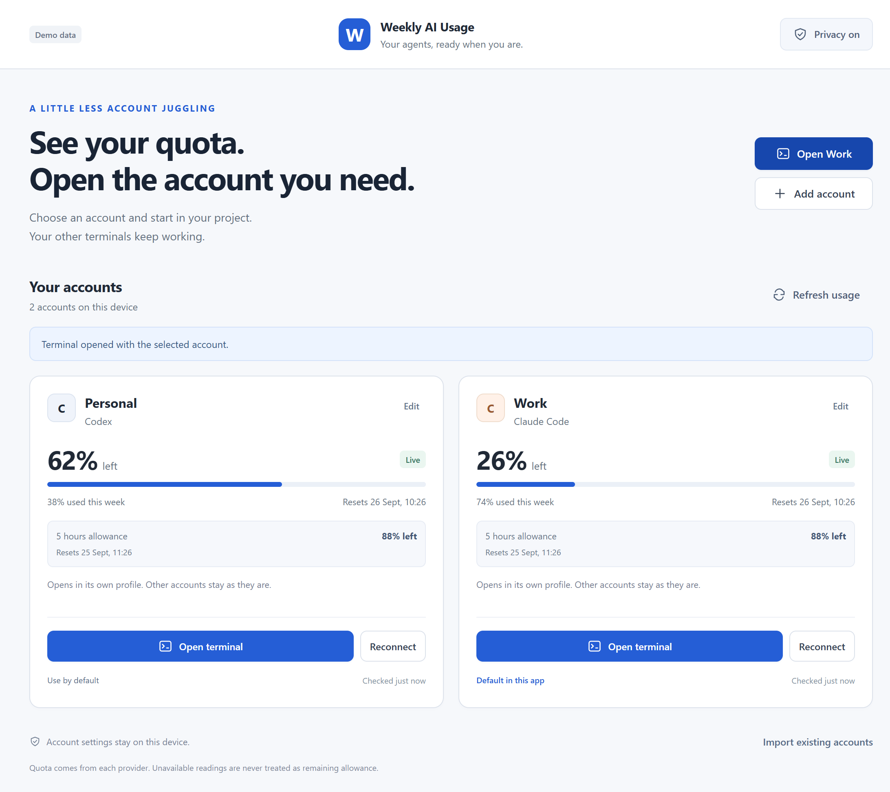
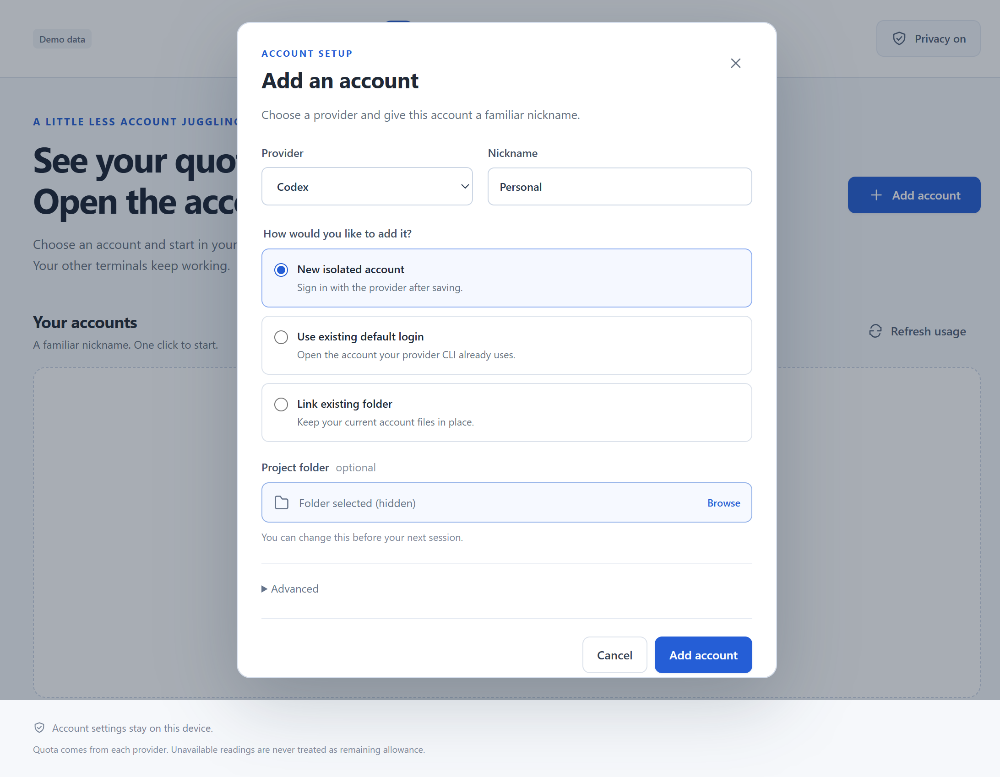

See quota and open the right agent account
=========================================

Weekly AI Usage helps you choose an account before starting work, then open it in your project without interrupting other sessions. Give accounts familiar nicknames such as Personal and Work. Check their reported allowance, choose one, and open a terminal.



Synthetic demo data. Account emails and local paths are hidden.

Preview v0.3.0-preview.1:

| Your computer | Download |
| --- | --- |
| Windows 10/11, x64 | [Windows Setup](https://github.com/naimkatiman/weekly-ai-usage/releases/download/v0.3.0-preview.1/WeeklyAIUsage-0.3.0-preview.1-Setup-x64.exe) |
| macOS 13+, Apple Silicon | [Mac DMG, arm64](https://github.com/naimkatiman/weekly-ai-usage/releases/download/v0.3.0-preview.1/WeeklyAIUsage-0.3.0-preview.1-macOS-arm64.dmg) |
| macOS 13+, Intel | [Mac DMG, x64](https://github.com/naimkatiman/weekly-ai-usage/releases/download/v0.3.0-preview.1/WeeklyAIUsage-0.3.0-preview.1-macOS-x64.dmg) |

Both platforms include Node.js. You do not need to install it separately. Install your provider's CLI separately: [Codex](https://developers.openai.com/codex/cli/) 0.156.0 or newer, or [Claude Code](https://code.claude.com/docs/en/overview) 2.1.63 or newer, for isolated accounts.

Windows Setup is unsigned. The Mac app is ad-hoc signed and not notarized. Your operating system may block these previews or display publisher warnings. They do not meet policies that require verified publishers. [Release notes and SHA256 checksums](https://github.com/naimkatiman/weekly-ai-usage/releases).

Start with one account
----------------------

1. Run Windows Setup, or open the matching Mac DMG and drag Weekly AI Usage into Applications.
2. Open the app and choose Add account. Pick Codex or Claude Code, enter a nickname, and keep New isolated account selected. Choose your project folder if you want the terminal to start there.
3. Save, then choose Sign in on the account card. Complete the provider's own login in the terminal/browser it opens.
4. Return to the app and choose Refresh usage. Live means the provider supplied a usable quota reading. An unavailable reading does not prevent you from checking the account in its CLI.
5. Choose Open terminal on the account you want to use.

Already signed in? Choose Use existing default login to link the account your normal CLI uses. The app can open it, but cannot reconnect that shared login. To retain a custom profile, choose Link existing folder; its credentials stay where they are. See [troubleshooting](docs/troubleshooting.md) if an agent is missing or a login needs attention.

If no project folder is selected, the terminal starts in your user home. Account credential folders cannot be used as project folders.



Choose Use by default for your usual account. The main button and tray menu then open that account. This changes future launches from this app only. Existing terminals keep their selected account, and your normal CLI defaults stay unchanged.

Minimize to keep the app in the tray or menu bar. Closing its window exits it. Quota refreshes on startup and every 15 minutes when the app is running.

Provider support
----------------

| Provider | Account launch | Quota |
| --- | --- | --- |
| Codex | Separate login and terminal per isolated profile; existing default login can also be linked. | Weekly and 5-hour windows when reported. File credentials and selected macOS Keychain entries supported. |
| Claude Code | Separate login and terminal per isolated profile; existing default login can also be linked. | Weekly and 5-hour windows when reported. File credentials and selected macOS Keychain entries supported. |
| Grok | Existing default login only. Custom profile folders are usage-only; isolated switching is unavailable. | Weekly credits from an existing profile. Enter its account email under Advanced. |
| Devin | Existing local login only; isolated switching and in-app sign-in are unavailable. | Weekly/daily quota where reported, for `server.codeium.com` logins only. Enter its email under Advanced. |

Other agents are not supported in this release. Codex ephemeral and encrypted auth stores are not supported for quota reads. Unsupported storage, denied Keychain access and missing provider data produce Unavailable, never an invented allowance. Provider usage endpoints can change without notice.

| Reading | Meaning |
| --- | --- |
| Live | The provider returned a usable current reading. |
| Stale | An earlier reading is displayed with its original capture time. |
| Reset pending | The reported reset time passed; a fresh reading is needed. |
| Unavailable | No usable reading. This does not mean zero usage or zero allowance. |

Privacy and account safety
--------------------------

Privacy is on by default. Account cards use nicknames; emails and saved paths are excluded from the renderer's state. Click the Privacy on button to reveal details when you need to verify an identity. Provider terminals and browser login pages can still display your account details.

Provider CLIs own sign-in and token renewal. The dashboard reads the selected profile and sends authentication only to that provider's identity/usage services. It never copies credentials into another profile, replaces a global login or uploads cloud secrets. Explicit profile folders never borrow credentials from the default login. Remove from app removes the reference, retaining the provider login and files.

The public repository, tests and release demos use synthetic accounts. Your account information belongs only in local application/provider data. Local metadata can still contain private email addresses and folder paths; privacy mode does not encrypt those files.

Upgrade from the Windows dashboard
----------------------------------

Close the old app and run the new Setup in its existing location. In the new app, choose Import existing accounts, select the old `accounts.json`, then confirm Import references. The old installer normally kept that file under `%LOCALAPPDATA%\Programs\Weekly AI Usage`. If you used `WEEKLY_USAGE_CONFIG`, select that file instead. Import is explicit and links existing folders; no provider credentials are copied or moved. Entries that cannot be imported are reported as skipped.

If you already use `agent-auth`, Import existing accounts also offers to link its local Codex and Claude profile folders. Discovery reads directory names only. Credentials stay in place and already-linked folders are skipped. Account names and identities remain local.

The new app stores its own data separately:

| Platform | Application data |
| --- | --- |
| Windows | `%LOCALAPPDATA%\Weekly AI Usage` |
| macOS | `~/Library/Application Support/Weekly AI Usage` |

`profile-store.json` holds account references and preferences. `quota-cache.json` holds recent readings. New isolated provider homes live under `profiles` in that directory. Keep those homes at stable paths, particularly for Claude's macOS Keychain entries. Updating or uninstalling the app retains this data. Removing that directory manually can remove managed provider logins too.

Preview verification
--------------------

Automated checks use synthetic accounts, including isolated profile/launcher tests and a private temporary Keychain on macOS CI. Real macOS provider sign-in, two-account concurrency and renewal have not been verified. A successful build or demo does not establish those results. First-time-user setup timing remains unmeasured.

The v0.1/v0.2 screenshots and videos describe earlier Windows releases. Use the current app for a new walkthrough; the [LinkedIn draft](docs/linkedin-preview.md) includes a recording plan.

Development
-----------

Use Node.js 24.21.0 and Git. After cloning this repository:

```sh
npm ci --ignore-scripts
node node_modules/electron/install.js
npm test
node --test scripts/package.test.cjs
npm run privacy
npm run test:desktop
npm start
npm run package:desktop
```

Build on the target Mac architecture, or Windows x64 with an existing Inno Setup 6 compiler. `ISCC_PATH` can select an existing compiler; the build does not install one. Packages and SHA256 files go into `dist`. The bundled Node archive is pinned and verified before extraction. Electron makes these installers larger than the earlier native Windows dashboard.

Before a public push, run the privacy check against source and outgoing commits; use public no-reply commit authorship. Packaging scans an explicit file allowlist and the resulting app. Keep real profile stores, credentials and diagnostics out of fixtures and artifacts.

MIT. See [LICENSE](LICENSE). The legacy tray icon uses Lucide gauge geometry, ISC License.
